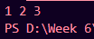
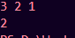
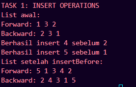
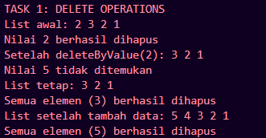
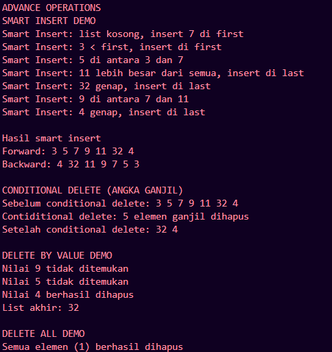

# Laporan Praktikum Struktur Data

## 1. Nama, NIM, Kelas
- **Nama**: Ariel Ahnaf Kusuma
- **NIM**: 103112400050
- **Kelas**: IF-12-05

## 2. Motivasi Belajar Struktur Data
Agar saya lebih paham tentang dunia pemrograman dan juga dapat menguasai bahasa C++ agar saat dapat digunakan di dunia pekerjaan nanti 

## 3. Dasar Teori
Linked list adalah strukur data linier berbentuk rantai simpul di mana setiap simpul menyimpan 2 item, yaitu nilai data dan pointer ke simpul elemen berikutnya. Berbeda dengan array, elemen linked list tidak ditempatkan dalam alamat memori yang berdekatan melainkan elemen ditautkan menggunakan pointer.

Keunggulan dari Double Linked List:

- Memungkinkan pergerakan maju dan mundur.
- Memungkinkan penghapusan sebuah node dalam waktu O(1) jika pointernya diketahui.
- Mendukung insertion yang mudah baik di awal maupun di akhir.
- Berguna untuk mengimplementasikan fungsi undo/redo, riwayat browser, dan navigasi daftar putar.

Kelemahan dari Double Linked List:

- Membutuhkan memori tambahan untuk menyimpan pointer tambahan ( prev).
- Penyisipan dan penghapusan menjadi lebih kompleks karena melibatkan penanganan dua pointer.
- Operasi sedikit lebih lambat karena pembaruan pointer tambahan.
- Kurang ramah terhadap cache karena node tersebar di memori.

## 4. Guided
### 4.1 Guided 1
#### Source Code 
#### dll_insert
Source Code

#include <iostream>
#define Nil NULL
using namespace std;

typedef int infotype;
typedef struct elmlist *address;

struct elmlist {
    infotype info;
    address next;
    address prev;
};

struct List {
    address first;
    address last;
};

void insertFirst(List &L, address P) {
    P->next = L.first; // Set pointer next dari P ke elemen pertama saat ini
    P->prev = Nil; // Set pointer prev P ke Nil karena menjadi elemen pertama
    if (L.first != Nil) L.first->prev = P; // Jika list tidak kosong, set prev elemen pertama lama ke P
    else L.last = P; // Jika lits kosong, set last juga ke P
    L.first = P; //Update first list menjadi P
}

void insertLast(List &L, address P, address R) {
    P->prev = L.last; // Set pointer prev dari P ke elemen terakhir saat ini
    P->next = Nil; 
    if (L.last != Nil) L.last->next = P;
    else L.first = P;
    L.last = P;
}

void insertAfter(List &L, address P, address R) {
    P->next = R->next; // Set pointer next dari P ke elemen setelah R
    P->prev = R; // Set pointer prev dari P ke R
    if (R->next != Nil) R->next->prev = P; // Jika R bukan elemen terakhir, set prev elemen setelah R ke P
    else L.last = P; // Jika R adalah elemen terakhir, update last list menjadi P
    R->next = P; // Set pointer next dari R ke P
}

address alokasi(infotype x) {
    address P = new elmlist; // Alokasi memori untuk elemen baru
    P->info = x; // Set info elemen baru
    P->next = Nil; // Inisialisasi next ke Nil
    P->prev = Nil; // Inisialisasi prev ke Nil
    return P; // Kembalikan alamat elemen baru
}

void printInfo(List L) {
    address P = L.first; // Set P ke elemen pertama list
    while (P != Nil) { // Loop selama P tidak Nil
        cout << P->info << " "; // Cetak info dari P
        P = P->next; // Pindah ke elemen berikutnya
    }
    cout << endl;
}
int main() {
    List L;
    L.first = Nil;
    L.last = Nil;

    address P1 = alokasi(10);
    address P2 = alokasi(20);
    address P3 = alokasi(30);

    insertFirst(L, P1); // Insert 10 at the beginning
    insertLast(L, P2, L.last); // Insert 20 at the end
    insertAfter(L, P3, P1); // Insert 30 after 10

    printInfo(L); // Expected output: 10 30 20

    return 0;
}

### Output

#### Penjelasan code
Program ini mengimplementasikan DLL insertFirst, insertLast dan insertAfter, lalu mendemonstrasikan dengan menyusun node berisi angka 1, 2, dan 3 secara dinamis

## 4. Guided
### 4.2 Guided 2
#### Source Code 
#### dll_hapus
Source Code

#include <iostream>
using namespace std;
#define Nil NULL

typedef int infotype;
typedef struct elmlist *address;

struct elmlist {
    infotype info;
    address next;
    address prev;
};

struct List {
    address first;
    address last;
};

address alokasi(infotype x) {
    address P = new elmlist; // Alokasi memori untuk elemen baru
    P->info = x; // Set info elemen baru
    P->next = Nil; // Inisialisasi next ke Nil
    P->prev = Nil; // Inisialisasi prev ke Nil
    return P; // Kembalikan alamat elemen baru
}
void dealokasi(address &P) { if (P != Nil) { delete P; P = Nil; } }
void insertFirst(List &L, address P) {
    P->next = L.first; // Set pointer next dari P ke elemen pertama saat ini
    P->prev = Nil; // Set pointer prev P ke Nil karena menjadi elemen pertama
    if (L.first != Nil) L.first->prev = P; // Jika list tidak kosong, set prev elemen pertama lama ke P
    else L.last = P; // Jika lits kosong, set last juga ke P
    L.first = P; //Update first list menjadi P
}
void printInfo(List &L) {
    address P = L.first; // Set P ke elemen pertama list
    while (P != Nil) { // Loop selama P tidak Nil
        cout << P->info << " "; // Cetak info dari P
        P = P->next; // Pindah ke elemen berikutnya
    }
    cout << endl;
}
void deleteFirst(List &L, address &P) {
    P = L.first; L.first = L.first->next; // Set first list ke elemen kedua
    if (L.first != Nil) L.first->prev = Nil; // Jika list tidak kosong, set prev elemen pertama ke Nil
    else L.last = Nil; // Jika list menjadi kosong, set last ke Nil
    P->next = Nil; // Putuskan hubungan next dari P
    P->prev = Nil; // Putuskan hubungan prev dari P
}
void deleteLast(List &L, address &P) {
    P = L.last; L.last = L.last->prev; // Set last list ke elemen sebelum terakhir
    if (L.last != Nil) L.last->next = Nil; // Jika list tidak kosong, set next elemen terakhir ke Nil
    else L.first = Nil; // Jika list menjadi kosong, set first ke Nil
    P->prev = Nil; // Putuskan hubungan next dari P
    P->next = Nil; // Putuskan hubungan prev dari P
}
void deleteAfter(List &L, address &P, address R) {
    P = R->next; // Set P ke elemen setelah R
    R->next = P->next; // Set next dari R ke elemen setelah P
    if (P->next != Nil) P->next->prev = R; // Jika P bukan elemen terakhir, set prev elemen setelah P ke R
    else L.last = R; // Jika P adalah elemen terakhir, update last list menjadi R
    P->prev = Nil; // Putuskan hubungan next dari P
    P->next = Nil; // Putuskan hubungan prev dari P
}

int main() {
    List L;
    L.first = Nil;
    L.last = Nil;
    insertFirst(L, alokasi(1)); insertFirst(L, alokasi(2)); insertFirst(L, alokasi(3));
    printInfo(L);
    address P;
    deleteFirst(L, P); dealokasi(P);
    deleteAfter(L, P, L.first); dealokasi(P);
    printInfo(L);
    return 0;
}

#### Output Code

#### Penjelasan
Fungsi Program ini membentuk list [3, 2, 1], lalu menghapus elemen pertama (3) dan elemen setelah head baru (1), sehingga menyisakan satu elemen bernilai 2 di memori. 

## 5. Unguided
### 5.1 Unguided 1
Source Code

#include <iostream>
#define Nil NULL
using namespace std;

typedef int infotype;
typedef struct elmlist *address;

struct elmlist {
    infotype info;
    address next;
    address prev;
};

struct List {
    address first;
    address last;
};

void insertFirst(List &L, address P) {
    P->next = L.first; 
    P->prev = Nil; 
    if (L.first != Nil) L.first->prev = P; 
    else L.last = P; 
    L.first = P; 
}

void insertLast(List &L, address P) {
    P->prev = L.last;
    P->next = Nil; 
    if (L.last != Nil) L.last->next = P; 
    else L.first = P; 
    L.last = P; 
}

void insertAfter(List &L, address P, address R) {
    P->next = R->next; 
    P->prev = R; 
    if (R->next != Nil) R->next->prev = P; 
    else L.last = P; 
    R->next = P; 
}

address alokasi(infotype x) {
    address P = new elmlist; 
    P->info = x; 
    P->next = Nil; 
    P->prev = Nil; 
    return P;
}

void printInfo(List L) {
    address P = L.first; 
    while (P != Nil) { 
        cout << P->info << " "; 
        P = P->next; 
    }
    cout << endl;
}

void insertBefore(List &L, address P, address R) {
    if (R == L.first) {
        insertFirst(L, P);
    } 
    else {
        P->next = R;
        P->prev = R->prev;
        R->prev->next = P; 
        R->prev = P;       
    }
}

void printReverse(List L) {
    address P = L.last; 
    while (P != Nil) { 
        cout << P->info << " "; 
        P = P->prev; 
    }
    cout << endl;
}

int main() {
    List L;
    L.first = Nil;
    L.last = Nil;
    address P1 = alokasi(1);
    address P3 = alokasi(3);
    address P2 = alokasi(2);
    insertFirst(L, P1);
    insertLast(L, P3); 
    insertLast(L, P2);
    cout << "TASK 1: INSERT OPERATIONS" << endl;
    cout << "List awal:" << endl;
    cout << "Forward: ";
    printInfo(L);
    cout << "Backward: ";
    printReverse(L); 
    address P4 = alokasi(4);
    insertBefore(L, P4, P2);
    cout << "Berhasil insert 4 sebelum 2" << endl;
    address P5 = alokasi(5);
    insertBefore(L, P5, P1); 
    cout << "Berhasil insert 5 sebelum 1" << endl;
    cout << "List setelah insertBefore:" << endl;
    cout << "Forward: ";
    printInfo(L);
    cout << "Backward: ";
    printReverse(L);
    return 0;
}

#### Output Code

#### Penjelasan
Program ini menambahkan fitur insertBefore, printReverse yang memanfaatkan pointer dua arah (next dan prev). Lalu program memanipulasi list menjadi urutan [5, 1, 3, 4, 2] melalui berbagai kombinasi insertion, lalu menampilkannya dari depan dan belakang untuk memastikan integritas pointer tetap terjaga.

### 5.2 Unguided 2
Source code

#include <iostream>
using namespace std;
#define Nil NULL

typedef int infotype;
typedef struct elmlist *address;

struct elmlist {
    infotype info;
    address next;
    address prev;
};

struct List {
    address first;
    address last;
};

address alokasi(infotype x) {
    address P = new elmlist; 
    P->info = x; 
    P->next = Nil; 
    P->prev = Nil; 
    return P; 
}

void dealokasi(address &P) { if (P != Nil) { delete P; P = Nil; } }

void insertFirst(List &L, address P) {
    P->next = L.first; 
    P->prev = Nil; 
    if (L.first != Nil) L.first->prev = P; 
    else L.last = P; 
    L.first = P; 
}

void printInfo(List &L) {
    address P = L.first; 
    while (P != Nil) { 
        cout << P->info << " "; 
        P = P->next; 
    }
    cout << endl;
}

void deleteFirst(List &L, address &P) {
    P = L.first; L.first = L.first->next; 
    if (L.first != Nil) L.first->prev = Nil; 
    else L.last = Nil; 
    P->next = Nil; 
    P->prev = Nil; 
}

void deleteLast(List &L, address &P) {
    P = L.last; L.last = L.last->prev; 
    if (L.last != Nil) L.last->next = Nil; 
    else L.first = Nil; 
    P->prev = Nil; 
    P->next = Nil;
}

void deleteAfter(List &L, address &P, address R) {
    P = R->next; 
    R->next = P->next; 
    if (P->next != Nil) P->next->prev = R; 
    else L.last = R; 
    P->prev = Nil; 
    P->next = Nil; 
}

address findElm(List L, infotype x) {
    address P = L.first;
    while (P != Nil) {
        if (P->info == x) {
            return P;
        }
        P = P->next;
    }
    return Nil;
}

bool deleteByValue(List &L, infotype x) {
    address P = findElm(L, x);
    if (P == Nil) {
        return false;
    }
    address Pdel; 
    if (P == L.first) {
        deleteFirst(L, Pdel);
    } else if (P == L.last) {
        deleteLast(L, Pdel);
    } else {
        address R = P->prev; 
        deleteAfter(L, Pdel, R);
    }
    dealokasi(Pdel);
    return true;
}

int deleteAll(List &L) {
    int count = 0;
    address Pdel;
    while (L.first != Nil) {
        deleteFirst(L, Pdel);
        dealokasi(Pdel);
        count++;
    }
    return count;
}

int main() {
    List L;
    L.first = Nil;
    L.last = Nil;
    insertFirst(L, alokasi(1));
    insertFirst(L, alokasi(2));
    insertFirst(L, alokasi(3));
    insertFirst(L, alokasi(2));
    cout << "TASK 1: DELETE OPERATIONS" << endl;
    cout << "List awal: ";
    printInfo(L);
    if (deleteByValue(L, 2)) {
        cout << "Nilai 2 berhasil dihapus" << endl;
    } else {
        cout << "Nilai 2 tidak ditemukan" << endl;
    }
    cout << "Setelah deleteByValue(2): ";
    printInfo(L);
    if (deleteByValue(L, 5)) {
        cout << "Nilai 5 berhasil dihapus" << endl;
    } else {
        cout << "Nilai 5 tidak ditemukan" << endl;
    }
    cout << "List tetap: ";
    printInfo(L);
    insertFirst(L, alokasi(4));
    insertFirst(L, alokasi(5));
    cout << "List setelah tambah data: ";
    printInfo(L);
    int count = deleteAll(L);
    cout << "Semua elemen (" << count << ") berhasil dihapus" << endl;
    return 0;
}

#### Output Code

#### Penjelasan Code
Program ini adalah modifikasi dari code prgram Guided 2, menambahkanfungsi penghapusan cerdas (deleteByValue) yang secara otomatis mendeteksi posisi elemen (awal, akhir, atau tengah) untuk memanggil prosedur hapus yang tepat. Dan membersihkan memori sepenuhnya menggunakan deleteAll.

### 5.3 Unguided 3
Source Code

#include <iostream>
using namespace std;
#define Nil NULL

typedef int infotype;
typedef struct dimasList *address;

struct dimasList {
    infotype info;
    address next;
    address prev;
};

struct List {
    address first;
    address last;
};

address alokasi(infotype x) {
    address P = new dimasList;
    P->info = x;
    P->next = Nil;
    P->prev = Nil;
    return P;
}

void dealokasi(address &x){
    delete x;
    x = Nil;
}

bool isEmpty(List L) {
    return (L.first == Nil);
}

address cariElm(List L, infotype x) {
    address P = L.first;
    while (P != Nil && P->info != x) {
        P = P->next;
    }
    return P;
}

/* ---------- Operasi insert ---------- */
void insertFirst(List &L, infotype D) {
    address P = alokasi(D);
    if (isEmpty(L)) {
        L.first = L.last = P;
    } else {
        P->next = L.first;
        L.first->prev = P;
        L.first = P;
    }
}

void insertLast(List &L, infotype D) {
    address P = alokasi(D);
    if (isEmpty(L)) {
        L.first = L.last = P;
    } else {
        P->prev = L.last;
        L.last->next = P;
        L.last = P;
    }
}

void insertAfter(List &L, infotype D, address target) {
    if (target == Nil) {
        cout << "Data tidak ditemukan";
        return;
    }
    if (target == L.last) {
        insertLast(L, D);   
        return;
    }
    address P = alokasi(D);
    P->next = target->next;
    P->prev = target;
    target->next->prev = P;
    target->next = P;
}

void insertBefore(List &L, infotype D, address target) {
    if (target == Nil) {
        cout << "Data tidak ditemukan";
        return;
    } else if (target == L.first) {
        insertFirst(L, D);
        return;
    }
    address P = alokasi(D);
    P->prev = target->prev;
    P->next = target;
    target->prev->next = P;
    target->prev = P;
}

/* ---------- Cetak ---------- */
void printInfo(List L){
    address P = L.first;
    while (P != Nil) {
        cout << P->info << " "; 
        P = P->next;
    }
    cout << endl;
}

void printReverse(List L) {
    address P = L.last;
    cout << "Backward: ";
    while (P != Nil) {
        cout << P->info << " "; 
        P = P->prev;
    }
    cout << endl;
}

/* ---------- SMART INSERT (≥4 kondisi + edge cases + pesan) ---------- */
void smartInsert(List &L, infotype x){
    cout << "Smart Insert: ";
    if (isEmpty(L)) {
        cout << "list kosong, insert " << x << " di first";
        insertFirst(L, x);
    } else if (x < L.first->info) {
        cout << x <<" < first, insert di first";
        insertFirst(L, x);
    } else if (x % 2 == 0) {
        cout << x << " genap, insert di last";
        insertLast(L, x);
    } else {
        address ada = cariElm(L, x);
        if (ada != Nil) {
            cout << " sudah ada, insert setelah " << x;
            insertAfter(L, x, ada);
        } else {
            address P = L.first;
            address target = Nil;
            while (P != Nil && P->info <= x) {
                P = P->next;
            }
            target = P;
            if (target == Nil) {
                cout << x << " lebih besar dari semua, insert di last";
                insertLast(L, x);
            } else {
                int left = (target->prev ? target->prev->info : -9999);
                cout << x << " di antara " << left << " dan " << target->info;
                insertBefore(L, x, target);
            }
        }
    }
    cout << endl;
}

/* ---------- Operasi delete (bantuan) ---------- */
void hapusNode(List &L, address aku) {
    if (aku == Nil) return;
    if (aku == L.first && aku == L.last) {
        L.first = L.last = Nil;
    } else if (aku == L.first) {
        L.first = aku->next;
        if (L.first) L.first->prev = Nil;
    } else if (aku == L.last) {
        L.last = aku->prev;
        if (L.last) L.last->next = Nil;
    } else {
        aku->prev->next = aku->next;
        aku->next->prev = aku->prev;
    }
    dealokasi(aku);
}

/* ---------- DELETION ---------- */
void hapusGanjil(List &L){
    if (isEmpty(L)){
        cout << "Conditional Delete: List kosong, tidak ada yang dihapus\n";
        return;
    }
    int jumlahAngka = 0;
    address P = L.first;
    while (P != Nil) {
        address next = P->next;
        if (P->info%2 != 0) {
            hapusNode(L, P);
            jumlahAngka++;
        }
        P = next;
    } 
    cout << "Contiditional delete: " << jumlahAngka << " elemen ganjil dihapus\n";
}

void hapusByValue(List &L, infotype x) {
    if (L.first == Nil) {
        cout << "Dalam list ini tidak ada data yang tersisa\n";
        return;
    } 
    address P = L.first;
    while (P != Nil && P->info != x) {
        P = P->next;
    }
    if (P == Nil){
        cout << "Nilai " << x << " tidak ditemukan\n";
    } else {
        hapusNode(L, P);
        cout << "Nilai " << x << " berhasil dihapus\n";
    }
}

void hapusSemua(List &L) {
    address P = L.first;
    int jumlahBilangan = 0;
    while (P!=Nil){
        address next = P->next;
        hapusNode(L, P);
        P = next;
        jumlahBilangan++;
    }
    cout << "Semua elemen (" << jumlahBilangan << ") berhasil dihapus";
}

int main () {
    List data;
    infotype value;
    data.first = Nil;
    data.last = Nil;
    cout << "ADVANCE OPERATIONS\n" << "SMART INSERT DEMO\n";
    smartInsert(data, 7);
    smartInsert(data, 3);
    smartInsert(data, 5);
    smartInsert(data, 11);
    smartInsert(data, 32);
    smartInsert(data, 9);
    smartInsert(data, 4);

    cout << "\nHasil smart insert\n" << "Forward: ";
    printInfo(data);
    printReverse(data);

    cout << "\nCONDITIONAL DELETE (ANGKA GANJIL)\n" << "Sebelum conditional delete: ";
    printInfo(data);
    hapusGanjil(data);
    cout << "Setelah conditional delete: ";
    printInfo(data);
    
    cout << "\nDELETE BY VALUE DEMO\n";
    hapusByValue(data, 9);
    hapusByValue(data, 5);
    hapusByValue(data, 4);
    cout << "List akhir: ";
    printInfo(data);

    cout << "\nDELETE ALL DEMO\n";
    hapusSemua(data);
}

#### Output Code

#### Penjelasan
Fugsi Program ini yaitu memanajemen memori yang agresif melalui operasi penghapusan kondisional (menghapus seluruh elemen ganjil sekaligus), penghapusan target spesifik, dan pembersihan total list. Kode ini menggunakan smartInsert dimana dia akan menentukan posisi insertion

## 6. Kesimpulan
Pada praktikum ini kami mempelejari DOubly Linked List dan mengimplementasikannya pada bahasa C++. Berbeda dengan Single Linked List, Doubly Linked List ini memiliki dua arah maju da mundur jadi ini membuat kita lebih mudah

## 7. Referensi
1. https://www.geeksforgeeks.org/cpp/doubly-linked-list-in-cpp/
2. https://www.trivusi.web.id/2022/07/struktur-data-linked-list.html
